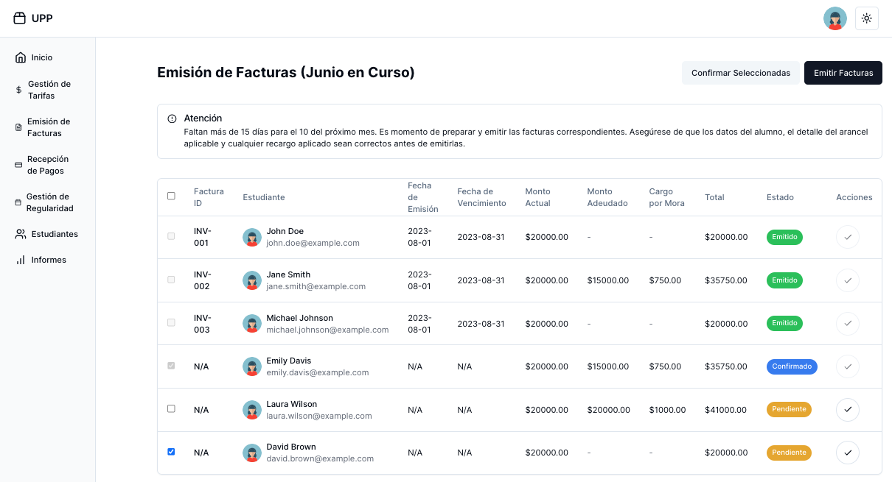

# Universidad Politécnica del Plata (UPP) Application

The UPP Frontend Application is a web interface designed to manage various aspects of user profiles, fees, invoices, and regularity management. This guide provides instructions on setting up the application locally using Next.js.

## 🌟 Features

- **User Management**: Create, read, update, and delete user profiles.
- **Fee Management**: Handle the management of student fees.
- **Issuing Invoices**: Generate and manage invoices.
- **Receiving Payments**: Track and record payments received.
- **Regularity Management**: Ensure regularity and compliance within the system.

[](docs.png)

## 🛠️ Installation

To set up the UPP Frontend Application on your local environment, follow these steps:

1. **Clone the Repository**:

   ```bash
   git clone git@github.com:LuisCusihuaman/aninfo-upp.git
   cd aninfo-upp
   ```

2. **Install Dependencies**:

   Ensure you have Node.js and pnpm installed. Then, run the following command to install the dependencies:

   ```bash
   pnpm install
   ```

3. **Run the Development Server**:

   Start the development server with the following command:

   ```bash
   pnpm dev
   ```

## 🤝 Contributors

Contributions are welcome!

Feel free to submit a pull request or open an issue for any improvements or bug fixes.
